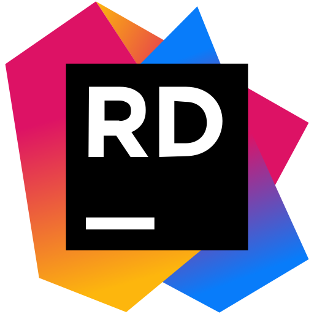
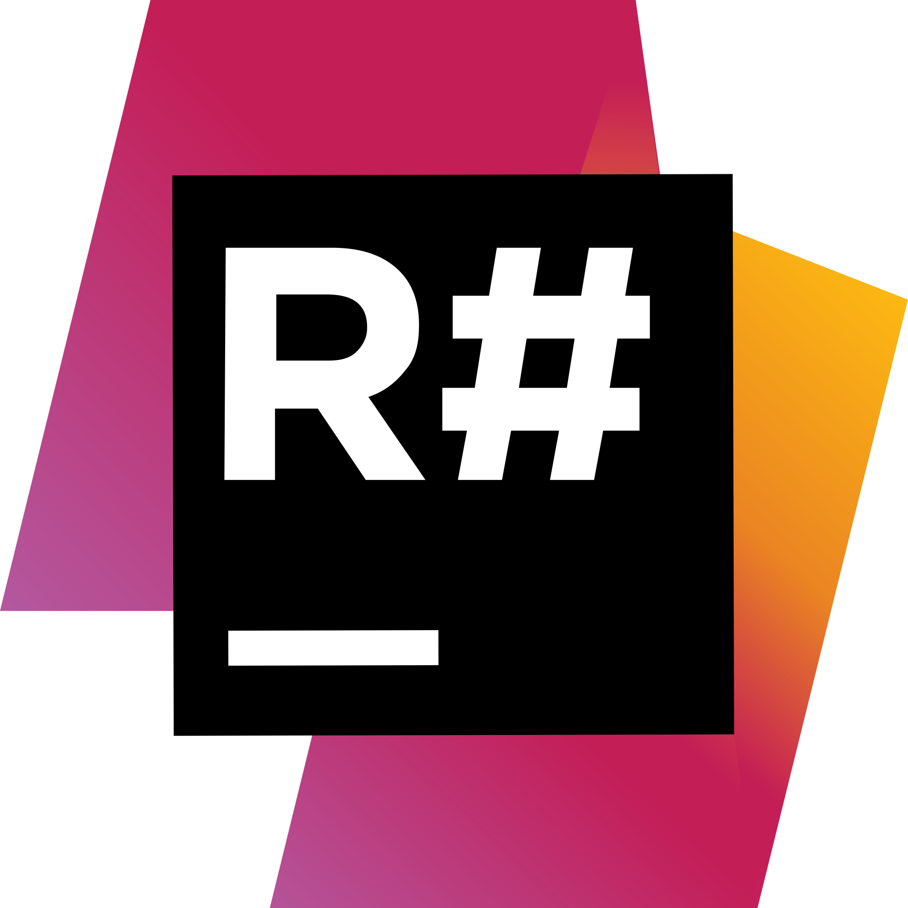

# QQBot.Net

---

**English** | [简体中文](./README.zh-CN.md)

---

**QQBot.Net** is an unofficial C# .NET implementation for QQ Bot API [v1] and [v2].

[v1]: https://bot.q.qq.com/wiki/develop/api/
[v2]: https://bot.q.qq.com/wiki/develop/api-v2/

---

## Source & Documentation

Source code is available on [GitHub](https://github.com/gehongyan/QQBot.Net).

Documents are available on [qqbotnet.dev](https://qqbotnet.dev). (Simplified Chinese available only)

---

## Targets

- [.NET 8.0](https://dotnet.microsoft.com/download/dotnet/8.0)
- [.NET 6.0](https://dotnet.microsoft.com/download/dotnet/6.0)

> [!TIP]
> Targets other than .NET 8.0 have not been fully tested.

---

## Installation

### Main Package

The main package provides all implementations of official APIs.

- QQBot.Net: [NuGet](https://www.nuget.org/packages/QQBot.Net/), [GitHub Packages](https://github.com/gehongyan/QQBot.Net/pkgs/nuget/QQBot.Net)

### Individual Packages

Individual components of the main package can be installed separately. These packages are included in the main package.

- QQBot.Net.Core: [NuGet](https://www.nuget.org/packages/QQBot.Net.Core/),
  [GitHub Packages](https://github.com/gehongyan/QQBot.Net/pkgs/nuget/QQBot.Net.Core)
- QQBot.Net.Rest: [NuGet](https://www.nuget.org/packages/QQBot.Net.Rest/),
  [GitHub Packages](https://github.com/gehongyan/QQBot.Net/pkgs/nuget/QQBot.Net.Rest)
- QQBot.Net.WebSocket: [NuGet](https://www.nuget.org/packages/QQBot.Net.WebSocket/),
  [GitHub Packages](https://github.com/gehongyan/QQBot.Net/pkgs/nuget/QQBot.Net.WebSocket)

---

## License & Copyright

This package is open-source and is licensed under the [MIT license](LICENSE).

QQBot.Net was developed with reference to **[Discord.Net](https://github.com/discord-net/Discord.Net)**.

[Discord.Net contributors](https://github.com/discord-net/Discord.Net/graphs/contributors) holds the copyright
for portion of the code in this repository according to [this license](https://github.com/discord-net/Discord.Net/blob/dev/LICENSE).

---

## Acknowledgements

Special thanks to [Discord.Net](https://github.com/discord-net/Discord.Net) for such a great project.

  
  

Special thanks to [JetBrains](https://www.jetbrains.com) for providing free licenses for their awesome tools -
[Rider](https://www.jetbrains.com/rider/) and [ReSharper](https://www.jetbrains.com/resharper/) -
to develop QQBot.Net.
